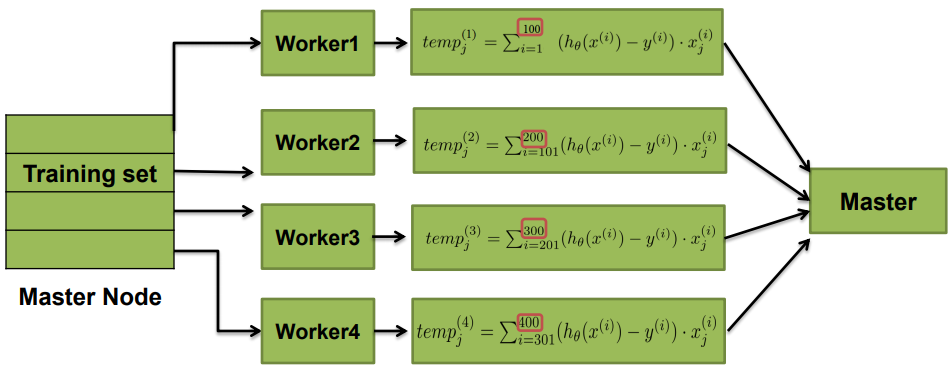

# Gradient-descent-Spark

Распределенная версия градиентного спуска в Apache Spark для линейной регрессии.

# Содержание  
[Теоретические сведения](#info)  
[Описание распределенного алгоритма](#algorithms)  
[Загрузка и визуализация данных](#data)  
[Оценка результатов](#results)  
[Комментарии к программе](#comments)  
[Список литературы](#links)  
  

<a name="info"><h2>Теоретические сведения</h2></a>

Рассмотрим алгоритм на примере линейной регрессии первого порядка:


Задача найти такие параметры тета, при которых функция ошибки (J) будет минимальна.

Обновление параметров происходит по следующей формуле:


Таким образом, для первого порядка:


<a name="algorithms"><h2>Описание распределенного алгоритма</h2></a>

В том случае, когда m >> j (например m = 100.000.000), где j число параметров, производительность вычислений резко снижается.  
Для решения данной проблемы применяют Mini-batch gradient descent.



В данном случае исходная выборка разбивается на равные части и параллельно поступает на узлы машины (машин) где производится подсчет локального градиента. 

После того как закончился подсчет локальных градиентов, обновляем параметры (тета) по формуле:


Таким образом, алгоритм будет выглядить следующим образом:  
1. Инициализируем вектор параметров случайными значениями  
2. Пока количество итераций не привысит максимально допустимое или пока ошибка больше порогового значения  
    > 2.1. Для каждого элемента вектора параметров  
    > >  2.1.1. Отправляем исходные данные на Worker'ы и считаем локальный градиент  
    > >  2.1.2. Суммируем локальные градиенты и обновляем вектор параметров  
    > >  2.1.3. Рассчитываем ошибку и сравниваем с предыдущим значением. Если ошибка больше предыдущего значения идем к пункту 4, 
    > иначе к пункту 2.1.  
3. Возвращаем найденный вектор параметров  
4. Конец алгоритма  

<a name="data"><h2>Загрузка и визуализация данных</h2></a>

Для удобства исследования и оценки разработанного алгоритма, в качестве исходных данных были выбраны данные с одной переменной.

Источник данных: [Bike Sharing Dataset Data Set](https://archive.ics.uci.edu/ml/datasets/Bike+Sharing+Dataset)

На Python был написан скрипт для обработки и визуализации входной выборки:


```python
import pandas as pd
import matplotlib.pyplot as plt

data = pd.read_csv("day.csv")
temps = data['atemp'].values
rentals = data['cnt'].values / 1000

plt.scatter(temps, rentals, marker='x', color='red')
plt.xlabel('Normalized Temperature in C')
plt.ylabel('Bike Rentals in 1000s')
plt.show()

f = open('sample.txt', 'w')

for t, r in zip(temps, rentals):
    f.write('%f %f\n' % (float(t), float(r)))
```

- atemp: Normalized feeling temperature in Celsius. The values are divided to 50 (max)
- cnt: count of total rental bikes including both casual and registered

Таким образом, формат данных файла sample.txt:
```       
0.363625 0.985000
0.353739 0.801000
0.189405 1.349000
0.212122 1.562000
0.229270 1.600000
0.233209 1.606000
0.208839 1.510000
0.162254 0.959000
0.116175 0.822000
```
Визуадизация данных:


<a name="results"><h2>Оценка результатов</h2></a>

Оценка алгоритма производилась с учетом результатов из источника: https://crsmithdev.com/blog/ml-linear-regression/ 

Исходные настройки:
``` 
dataSize = 731
thetasAmount = 2
initThetasValue = 0.0
alpha = 0.1
maxIteration = 5000
``` 

Результат выполнения программы:  
Error: 1.1291415830992968  
1.10667382  
7.15955107  

Результат полученный из источника:  
Error: 1.12758692584  
0.94588081  
7.50171673  

Полученные результаты могут свидетельствовать о корректной работе программы.

Визуализация результатов: 


<a name="comments"><h2>Комментарии к программе</h2></a>

В файле properties.cfg задаются параметры алгоритма. Вид файла:
``` 
dataPath = src/main/resources/sample.txt
dataSize = 731
thetasAmount = 2
initThetasValue = 0.0
alpha = 0.1
maxIteration = 5000
threshold = 0
``` 

Описание параметров:  
dataPath - путь к файлу с исходными данными  
dataSize - количество данных  
thetasAmount - количество параметров (параметров для оптимизации)  
initThetasValue - начальная инициализация параметров  
alpha - скорость обучения или размер шага  
maxIteration - максимальное число итераций, за которое должен завершиться алгоритм  
threshold - пороговое значение ошибки (если > 0 то алгоритм может завершиться при достижении порогового значения)  

<a name="links"><h2>Список литературы</h2></a>


