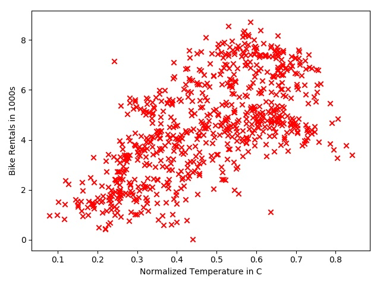

# Gradient-descent-Spark

На Python был написан скрипт для генерации и отображения входной выборки:

```python
import pandas as pd
import matplotlib.pyplot as plt

data = pd.read_csv("day.csv")
temps = data['atemp'].values
rentals = data['cnt'].values / 1000

plt.scatter(temps, rentals, marker='x', color='red')
plt.xlabel('Normalized Temperature in C')
plt.ylabel('Bike Rentals in 1000s')
plt.show()

f = open('sample3.txt', 'w')

for t, r in zip(temps, rentals):
    f.write('%f %f\n' % (float(t), float(r)))
```

- atemp: Normalized feeling temperature in Celsius. The values are divided to 50 (max)
- cnt: count of total rental bikes including both casual and registered

Вид файла sample3.txt:
```
0.363625 0.985000
0.353739 0.801000
0.189405 1.349000
0.212122 1.562000
0.229270 1.600000
0.233209 1.606000
0.208839 1.510000
0.162254 0.959000
0.116175 0.822000
```
Визуадизация данных:


